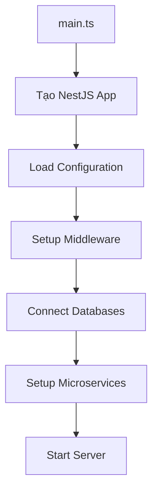
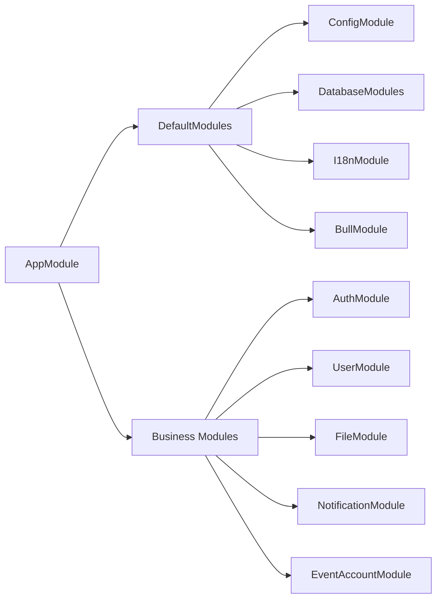
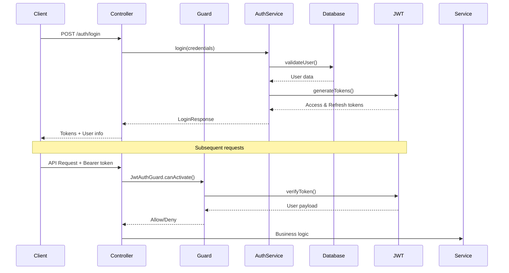
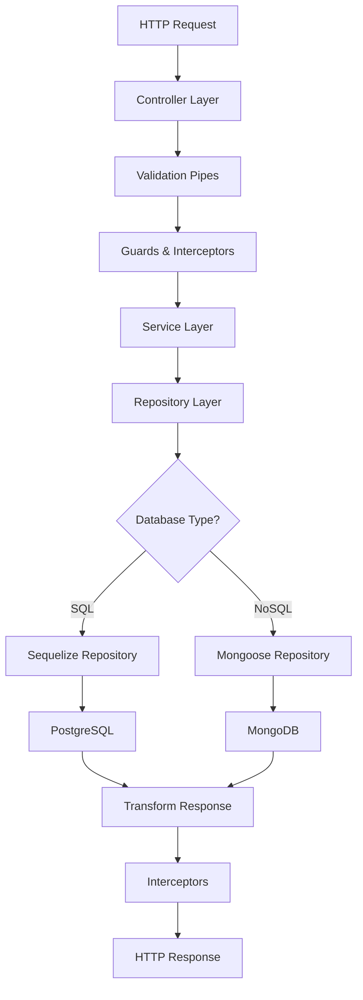
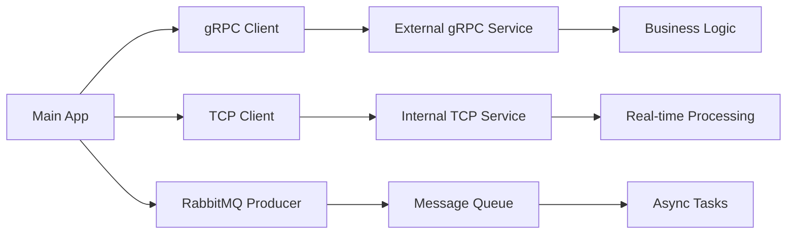
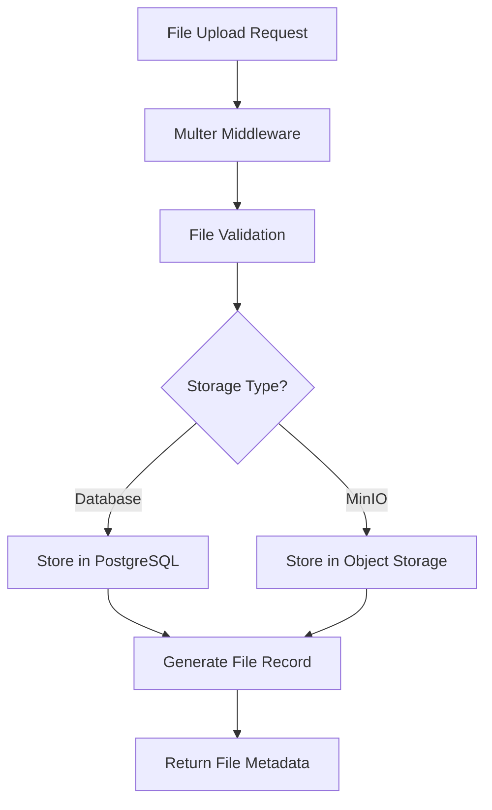
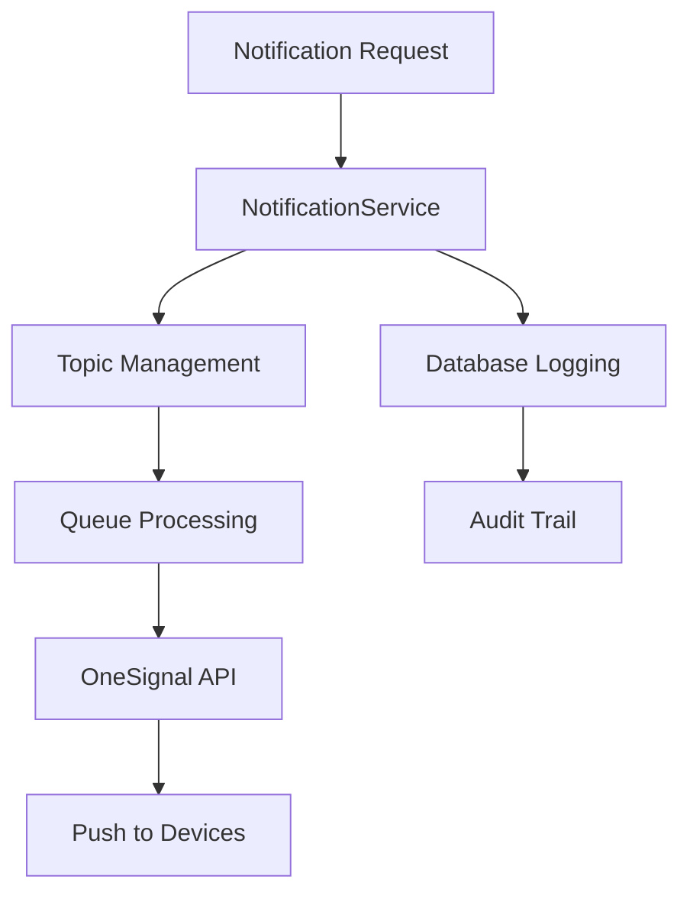
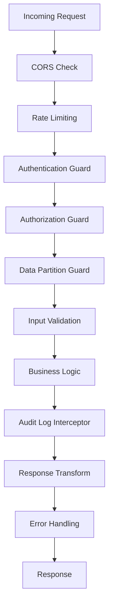
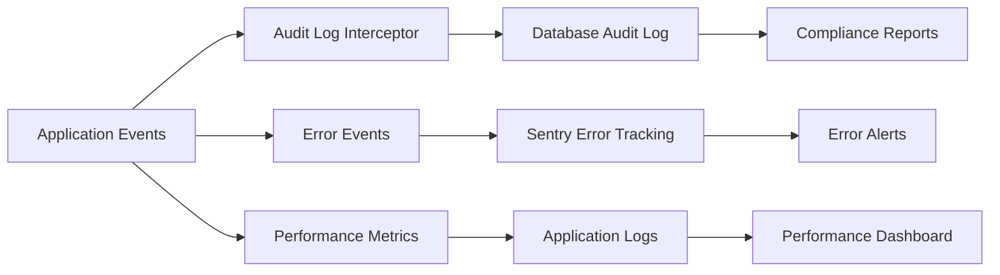
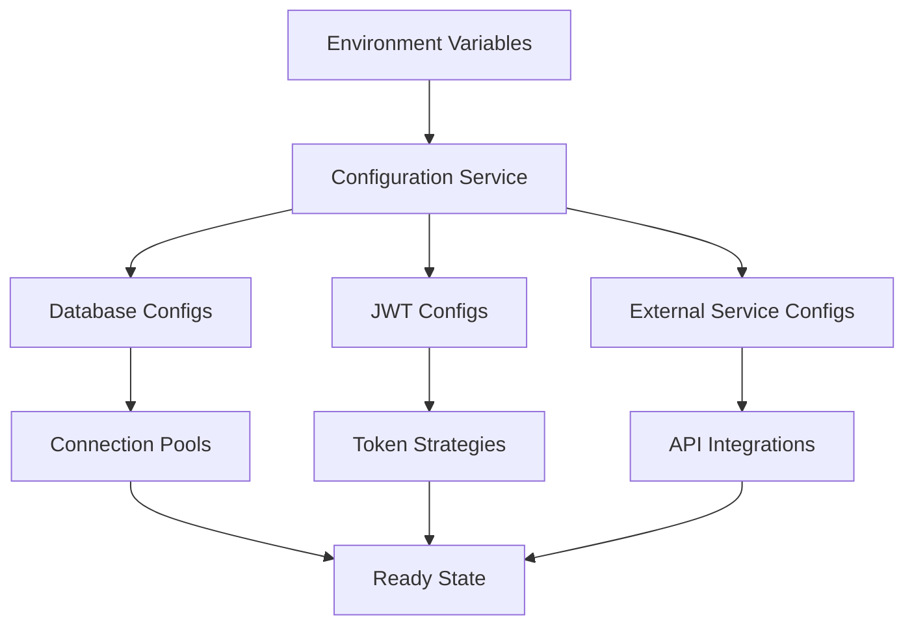

# BASE NESTJS BACKEND

## 📋 Tổng quan

Đây là một ứng dụng backend được xây dựng bằng NestJS framework, được thiết kế để phục vụ các ứng dụng enterprise với kiến trúc microservices và hỗ trợ đa cơ sở dữ liệu. Dự án cung cấp một nền tảng mạnh mẽ và có thể mở rộng cho các hệ thống phức tạp.

## 🚀 Tính năng chính

### 🔐 Hệ thống xác thực & phân quyền
- **JWT Authentication**: Xác thực người dùng với Access Token và Refresh Token
- **Single Sign-On (SSO)**: Tích hợp SSO với JWKS
- **Role-based Access Control**: Phân quyền dựa trên vai trò hệ thống
- **Session Management**: Quản lý phiên đăng nhập với thông tin thiết bị

### 📊 Quản lý dữ liệu
- **Multi-database Support**: Hỗ trợ cả MongoDB (NoSQL) và PostgreSQL (SQL)
- **Data Partitioning**: Phân vùng dữ liệu theo tenant/organization
- **Data Processing**: Xử lý và import dữ liệu hàng loạt
- **Audit Logging**: Ghi log toàn bộ hoạt động của hệ thống

### 📁 Quản lý file
- **Multiple Storage Options**: Hỗ trợ lưu trữ file trong database hoặc MinIO
- **File Upload/Download**: API upload và download file với validation
- **Export Functions**: Xuất dữ liệu ra Word, PDF, Excel, ZIP

### 🔔 Hệ thống thông báo
- **Push Notifications**: Tích hợp OneSignal cho thông báo push
- **Topic Management**: Quản lý chủ đề thông báo
- **Queue System**: Xử lý thông báo bất đồng bộ với Bull Queue

### 🏗️ Kiến trúc Microservices
- **gRPC Communication**: Giao tiếp microservices qua gRPC
- **TCP Socket**: Kết nối TCP cho real-time communication
- **RabbitMQ**: Message queue cho async processing
- **Redis**: Caching và session storage

## 🛠️ Công nghệ sử dụng

### Backend Framework
- **NestJS**: Node.js framework với TypeScript
- **Express**: Web server framework
- **TypeScript**: Strongly typed JavaScript

### Database & ORM
- **MongoDB**: NoSQL database với Mongoose ODM
- **PostgreSQL**: Relational database với Sequelize ORM
- **Redis**: In-memory cache và session store

### Authentication & Security
- **JWT**: JSON Web Tokens
- **bcryptjs**: Password hashing
- **Passport**: Authentication middleware

### File Storage & Processing
- **MinIO**: Object storage service
- **Multer**: File upload middleware
- **Sharp**: Image processing

### Monitoring & Logging
- **Sentry**: Error tracking và monitoring
- **Winston**: Logging framework

### Communication
- **gRPC**: High-performance RPC framework
- **Socket.io**: Real-time communication
- **Bull**: Redis-based queue system

### API Documentation
- **Swagger/OpenAPI**: API documentation
- **Class Validator**: Request validation
- **Class Transformer**: Data transformation

## 📁 Cấu trúc dự án

```
src/
├── main.ts                    # Entry point của ứng dụng
├── app.module.ts             # Module gốc
├── app.controller.ts         # Controller chính
├── config/                   # Cấu hình ứng dụng
│   ├── configuration.ts      # Cấu hình tập trung
│   ├── module/              # Cấu hình modules mặc định
│   ├── controller/          # Base controllers
│   ├── service/             # Base services
│   ├── exception/           # Exception handling
│   └── tcp/                 # TCP configuration
├── common/                   # Shared utilities
│   ├── constant/            # Hằng số và types
│   ├── decorator/           # Custom decorators
│   ├── dto/                 # Data Transfer Objects
│   ├── guard/               # Authentication guards
│   ├── interceptor/         # Request/response interceptors
│   ├── interface/           # Shared interfaces
│   ├── pipe/                # Validation pipes
│   └── utils/               # Utility functions
└── modules/                  # Business logic modules
    ├── auth/                # Xác thực và phân quyền
    ├── user/                # Quản lý người dùng
    ├── file/                # Quản lý file
    ├── notification/        # Hệ thống thông báo
    ├── one-signal/          # OneSignal integration
    ├── topic/               # Quản lý topics
    ├── setting/             # Cấu hình hệ thống
    ├── audit-log/           # Audit logging
    ├── data-partition/      # Phân vùng dữ liệu
    ├── data-process/        # Xử lý dữ liệu
    ├── import-session/      # Import session
    ├── quy-tac-ma/          # Quy tắc mã hóa
    ├── sso/                 # Single Sign-On
    ├── redis/               # Redis integration
    ├── minio/               # MinIO integration
    ├── microservice/        # Microservice communication
    ├── repository/          # Data access layer
    └── common-provider/     # Shared providers

sequelize/
├── config/                   # Database configuration
├── migrations/              # Database migrations
├── models/                  # Database models
└── seeders/                 # Database seeders
```

## 🔄 Luồng chạy tổng quan

### 1. 🚀 Khởi động ứng dụng (`src/main.ts`)



**Chi tiết quá trình:**
- **Bootstrap**: Khởi tạo NestJS application với Express platform
- **Configuration**: Load cấu hình từ environment variables qua `ConfigService`
- **Middleware Setup**: 
  - I18n middleware cho đa ngôn ngữ
  - CORS cho cross-origin requests
  - Body parser với limit 50MB
  - Validation pipes cho input validation
- **Database Connections**: Kết nối đồng thời MongoDB và PostgreSQL
- **Microservices**: Khởi động gRPC và TCP microservices
- **Swagger**: Setup API documentation
- **Sentry**: Khởi tạo error tracking

### 2. 📦 Tải modules (`src/app.module.ts`)



**Thứ tự tải modules:**
1. **Default Modules** (`src/config/module/config.ts`):
   - `ConfigModule`: Cấu hình toàn cục
   - `MongooseModule`: MongoDB connection
   - `SequelizeModule`: PostgreSQL connection
   - `I18nModule`: Đa ngôn ngữ
   - `BullModule`: Redis queue system
   - `RepositoryModule`: Data access layer

2. **Business Modules**: Các module nghiệp vụ được load theo dependency

### 3. 🔐 Luồng xác thực (Authentication Flow)



### 4. 📊 Luồng xử lý dữ liệu (Data Processing Flow)



**Chi tiết từng layer:**

#### 🎯 **Controller Layer** (`src/modules/*/controller/`)
- Nhận HTTP requests
- Validate input với DTOs
- Apply guards (authentication, authorization)
- Delegate business logic cho Service layer
- Transform response format

#### 🧠 **Service Layer** (`src/modules/*/service/`)
- Chứa business logic chính
- Orchestrate các operations phức tạp
- Handle transactions
- Integrate với external services
- Apply business rules và validations

#### 🗄️ **Repository Layer** (`src/modules/repository/`)
- Abstract database operations
- Implement Repository pattern
- Support cả SQL (Sequelize) và NoSQL (Mongoose)
- Handle data transformations
- Manage connections và transactions

### 5. 🔄 Luồng microservices



**Các loại communication:**
- **gRPC**: High-performance RPC cho internal services
- **TCP**: Real-time communication với custom protocol
- **RabbitMQ**: Async message processing
- **Redis**: Caching và session management

### 6. 📁 Luồng quản lý file



### 7. 🔔 Luồng thông báo



### 8. 🛡️ Luồng bảo mật và middleware



### 9. 📈 Luồng monitoring và logging



### 10. 🔧 Luồng cấu hình và khởi tạo



**Các bước khởi tạo:**
1. **Load Environment**: Đọc biến môi trường
2. **Validate Config**: Kiểm tra tính hợp lệ của cấu hình
3. **Initialize Connections**: Khởi tạo kết nối database
4. **Setup Security**: Cấu hình JWT, guards, interceptors
5. **Register Services**: Đăng ký các services và providers
6. **Health Check**: Kiểm tra trạng thái hệ thống

### 🎯 Điểm đặc biệt của kiến trúc:

1. **Modular Architecture**: Mỗi module độc lập với dependency injection
2. **Multi-Database**: Hỗ trợ đồng thời SQL và NoSQL
3. **Microservice Ready**: Sẵn sàng cho kiến trúc microservices
4. **Security First**: Bảo mật được tích hợp ở mọi layer
5. **Scalable Design**: Thiết kế có thể mở rộng dễ dàng
6. **Event-Driven**: Hỗ trợ xử lý bất đồng bộ với queues
7. **Observability**: Monitoring và logging toàn diện

## ⚙️ Cài đặt và cấu hình

### Yêu cầu hệ thống
- Node.js >= 16.x
- npm hoặc yarn
- PostgreSQL >= 12.x
- MongoDB >= 4.x
- Redis >= 6.x

### 1. Clone repository
```bash
git clone <repository-url>
cd nestjs-backend
```

### 2. Cài đặt dependencies
```bash
npm install
# hoặc
yarn install
```

### 3. Cấu hình environment variables
Tạo file `.env` và cấu hình các biến môi trường:

```env
# Server Configuration
SERVER_PORT=3000
SERVER_ENV=development
SERVER_ADDRESS=http://localhost:3000
SERVER_DOCUMENT_PATH=api
SERVER_DEFAULT_ADMIN_USERNAME=admin
SERVER_DEFAULT_ADMIN_PASSWORD=admin
SERVER_GW_ADDRESS=
SERVER_GW_API_KEY=
SERVER_MASTER=0

# Database Configuration
# PostgreSQL
SQL_TYPE=postgres
SQL_HOST=localhost
SQL_PORT=5432
SQL_USER=postgres
SQL_PASSWORD=password
SQL_DB=nestjs_db
SQL_SCHEMA=public
SQL_DB_MAX_POOL=5

# MongoDB
MONGODB_URI=mongodb://localhost:27017/nestjs_db
# hoặc
MONGODB_HOST=localhost
MONGODB_PORT=27017
MONGODB_NAME=nestjs_db
MONGODB_USER=
MONGODB_PASSWORD=

# Redis
REDIS_HOST=localhost
REDIS_PORT=6379
REDIS_PASSWORD=

# JWT Configuration
JWT_SECRET=your-jwt-secret
JWT_EXP=3600
JWT_REFRESH_SECRET=your-refresh-secret
JWT_REFRESH_EXP=604800

# Microservices
MICROSERVICE_GRPC_HOST=0.0.0.0
MICROSERVICE_GRPC_PORT=3001
MICROSERVICE_TCP_HOST=0.0.0.0
MICROSERVICE_TCP_PORT=3002
MICROSERVICE_RABBITMQ_URL=amqp://localhost:5672

# OneSignal
ONE_SIGNAL_APP_ID=your-onesignal-app-id
ONE_SIGNAL_API_KEY=your-onesignal-api-key

# SSO Configuration
SSO_JWKS_URI=https://your-sso-provider/.well-known/jwks.json
SSO_USERNAME_FIELD=preferred_username
SSO_EMAIL_FIELD=email

# Sentry
SENTRY_DSN=your-sentry-dsn

# MinIO
MINIO_ENDPOINT=localhost
MINIO_PORT=9000
MINIO_USE_SSL=0
MINIO_ADDRESS=http://localhost:9000
MINIO_ACCESS_KEY=minioadmin
MINIO_SECRET_KEY=minioadmin
MINIO_REGION=us-east-1
MINIO_BUCKET=nestjs-bucket
MINIO_MULTIPART_PART_SIZE=16777216

# File Storage
SEVER_DEFAULT_FILE_STORAGE=Database
```

### 4. Khởi tạo database
```bash
# Chạy migrations
npx sequelize-cli db:migrate

# Chạy seeders
npx sequelize-cli db:seed:all
```

### 5. Chạy ứng dụng

#### Development mode
```bash
npm run start:dev
# hoặc
yarn start:dev
```

#### Production mode
```bash
npm run build
npm run start:prod
# hoặc
yarn build
yarn start:prod
```

## 📖 API Documentation

Sau khi chạy ứng dụng, bạn có thể truy cập:

- **Main API Documentation**: `http://localhost:3000/api`
- **Internal API Documentation**: `http://localhost:3000/internal/document`
- **Microservice API Documentation**: `http://localhost:3000/microservice/api`

## 🔧 Scripts có sẵn

```bash
# Development
npm run start:dev          # Chạy ở development mode với hot reload
npm run start:debug        # Chạy với debug mode

# Production
npm run build             # Build ứng dụng
npm run start:prod        # Chạy ở production mode

# Testing
npm run test              # Chạy unit tests
npm run test:e2e          # Chạy end-to-end tests
npm run test:cov          # Chạy tests với coverage

# Linting & Formatting
npm run lint              # Kiểm tra code style
npm run format            # Format code

# Database
npx sequelize-cli db:migrate        # Chạy migrations
npx sequelize-cli db:seed:all       # Chạy seeders
npx sequelize-cli migration:create  # Tạo migration mới
npx sequelize-cli seed:create       # Tạo seeder mới
```

## 🌐 Endpoints chính

### Authentication
- `POST /auth/login` - Đăng nhập
- `POST /auth/logout` - Đăng xuất
- `POST /auth/refresh` - Refresh token

### User Management
- `GET /user` - Lấy danh sách người dùng
- `POST /user` - Tạo người dùng mới
- `PUT /user/:id` - Cập nhật người dùng
- `DELETE /user/:id` - Xóa người dùng

### File Management
- `POST /file/upload` - Upload file
- `GET /file/:id` - Download file
- `DELETE /file/:id` - Xóa file

### Notifications
- `POST /notification` - Gửi thông báo
- `GET /notification` - Lấy danh sách thông báo

## 🔒 Security Features

- **Input Validation**: Validation tất cả input với class-validator
- **SQL Injection Protection**: Sử dụng ORM để tránh SQL injection
- **XSS Protection**: Sanitize input data
- **Rate Limiting**: Giới hạn số request per IP
- **CORS**: Cấu hình Cross-Origin Resource Sharing
- **Helmet**: Security headers middleware
- **JWT Security**: Secure token implementation với refresh mechanism

## 🚀 Deployment

### Docker
```dockerfile
# Dockerfile example
FROM node:16-alpine
WORKDIR /app
COPY package*.json ./
RUN npm ci --only=production
COPY . .
RUN npm run build
EXPOSE 3000
CMD ["npm", "run", "start:prod"]
```

### Docker Compose
```yaml
version: '3.8'
services:
  app:
    build: .
    ports:
      - "3000:3000"
    environment:
      - NODE_ENV=production
    depends_on:
      - postgres
      - mongodb
      - redis

  postgres:
    image: postgres:13
    environment:
      POSTGRES_DB: nestjs_db
      POSTGRES_USER: postgres
      POSTGRES_PASSWORD: password
    volumes:
      - postgres_data:/var/lib/postgresql/data

  mongodb:
    image: mongo:4.4
    volumes:
      - mongodb_data:/data/db

  redis:
    image: redis:6-alpine

volumes:
  postgres_data:
  mongodb_data:
```

## 🤝 Contributing

1. Fork repository
2. Tạo feature branch (`git checkout -b feature/amazing-feature`)
3. Commit changes (`git commit -m 'Add some amazing feature'`)
4. Push to branch (`git push origin feature/amazing-feature`)
5. Tạo Pull Request

## 📝 License

Distributed under the MIT License. See `LICENSE` for more information.

## 📞 Support

Nếu bạn gặp vấn đề hoặc có câu hỏi, vui lòng tạo issue trên GitHub repository.

---

**Developed with ❤️ using NestJS**
